# 🦞 OpenClaw — 互联网技术中心内部分享

> **互联网技术中心内部分享 · 2026.03.10**

---

## OpenClaw 是什么？

> **"运行在本地，可以通过飞书/微信等远程指挥，7×24 自动运转的 AI 助手"**

### 🏆 GitHub 全站 Star #1


| 指标 | 数据 | 指标 | 数据 |
| :--- | :--- | :--- | :--- |
| ⭐ Stars | **279k** | 🍴 Forks | **53.1k** |
| 👥 Contributors | **1,100** | 📝 Commits | **17k** |
| 🐛 Issues | **15.6k** | 🔀 PRs | **22k** |

`MIT 开源` · `自托管` · `22+ 渠道` · `真 Agent`

---

## 🏗️ Architecture：核心架构

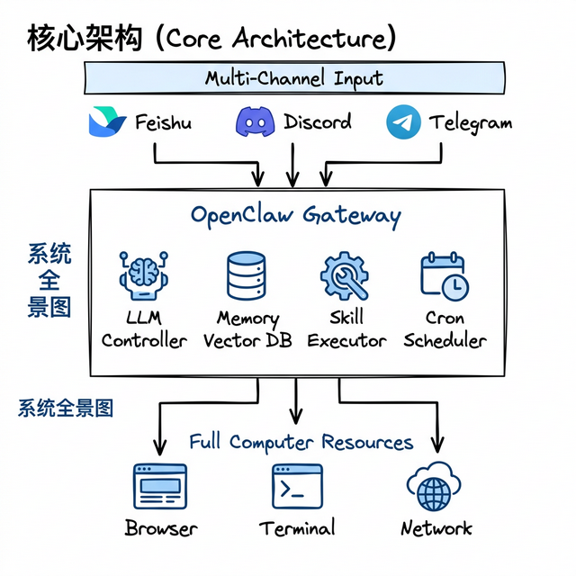

---

## 为什么爆火？—— 破圈密码：社交逻辑

> **不仅是硬核工具，更是极具传播张力的社会化叙事**

- 💰 **“一人公司”叙事** — 极具煽动性的增收案例 (“1人+N只大龙虾=1家公司”)
- 🗣️ **交互逻辑降维** — 动动嘴控制电脑干活 (满足最原始的掌控感，给人低门槛、高上限的感觉)
- 🦞 **“养龙虾”热梗** — 赛博宠物 (品牌人格化，降低技术疏离感，形成独特的社区符号)

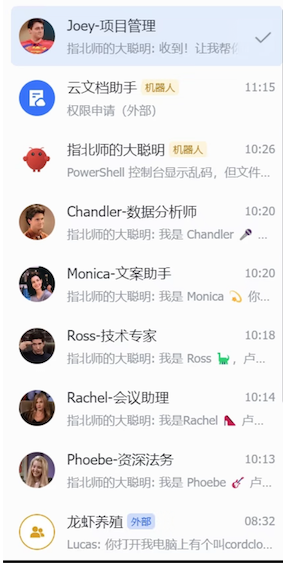
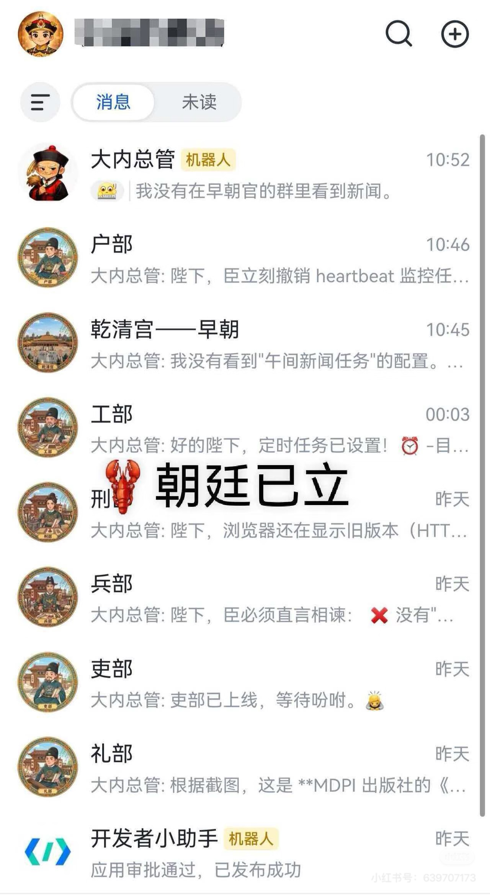

---

## 为什么爆火？—— 极致的技术底座

> **底层足够硬核，才能支持上层的无限可能**

- 🔓 **开源 + 本地部署** — 数据隐私与主权
- 🤖 **多 Agent 协作** — 分工明确的智能体组织（1+N 模式）
- 🧠 **Memory 系统** — 跨会话文件级记忆，越用越懂你
- 📚 **Skill 生态** — 通关 Markdown 即可无限扩展能力
- ⚡ **7×24 自动化** — Webhook/Cron 驱动
- 💬 **多渠道整合** — 覆盖 22+ 条主流沟通渠道
- 🔌 **多模型切换** — OpenAI / Claude / 本地模型自由插拔

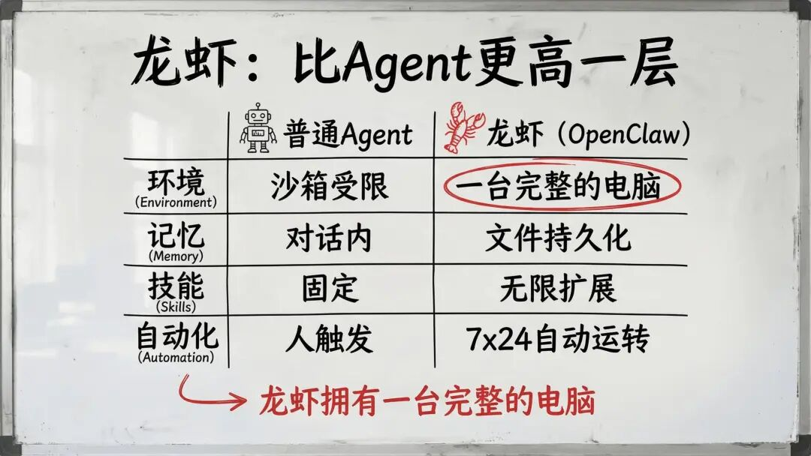

---

## 🖥️ 运行环境：一台完整的电脑

> **从"沙箱里的对话框"进化为"拥有完整权限的数字员工"**

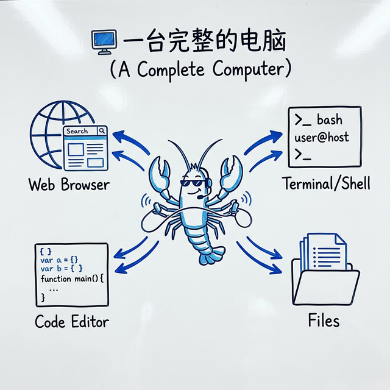

- **完整系统权限** — Shell、文件、网络全打通
- **浏览器自动化** — 像真人一样操作网页
- **软件协同** — 邮件、Office、API 调用全打通
- **低配即可** — 普通老电脑就能当 AI 工位

---

## 🧠 Memory：越用越懂你

> **LLM 说"我记住了"只是幻觉，OpenClaw 用文件系统构建真实记忆**

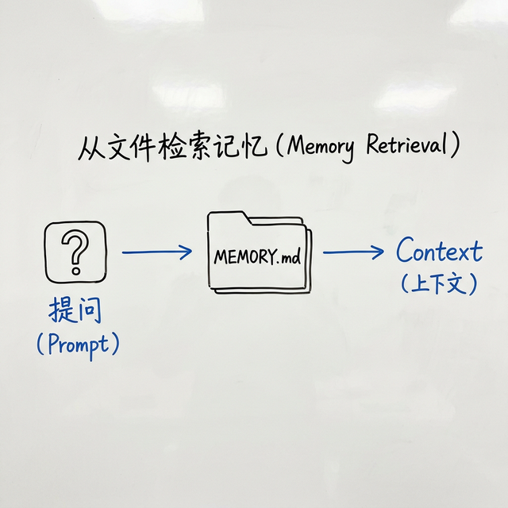

- **记忆文件** — 每日记录与核心事实持久化存储
- **混合检索** — 语义向量 + 关键词混合检索
- **自动冲刷 (Auto Flush)** — 自动将重要事实存入本地文件
- **SQLite-vec 加速** — 本地高性能向量引擎

---

## 📚 Skill：能力拓展，自我进化

> **无需复杂编码，通过 Markdown 文件即可赋予 Agent 全新能力**

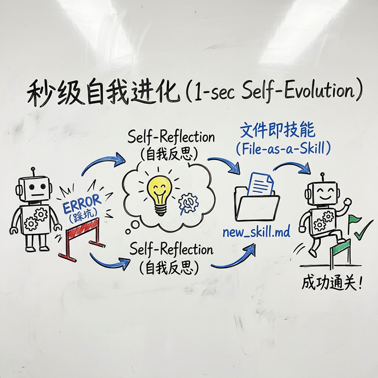

- **SKILL.md** — 只需描述"做什么"和"怎么做"
- **极简扩展** — `/skills` 下新建文件夹即可瞬间习得
- **ClawHub 生态** — 官方与社区技能一键安装
- **自我进化** — 解决问题后自动反思并生成 Skill

---

## ⚡ 自动化：7×24 不间断

> **不会累、不会情绪化、不会因为放假就消失**

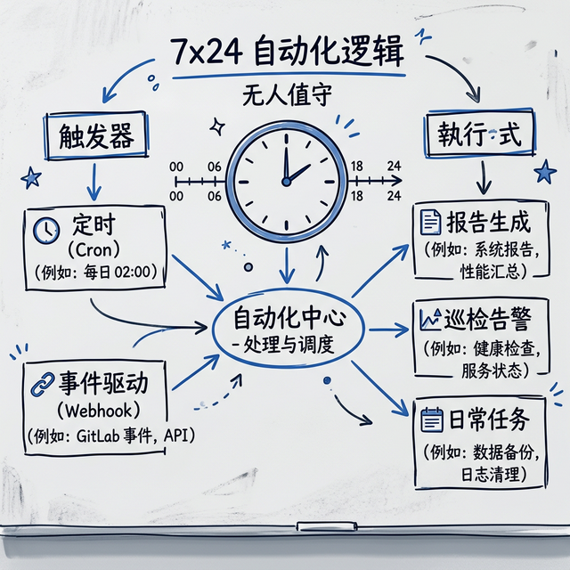

- **Cron 定时任务** — 定时执行
- **主动监控** — 主动响应相关事件
- **Webhook 触发** — 外部事件自动激发

---

## 💬 Channels：多渠道整合

> **你在哪里，龙虾就在哪里。支持 20+ 主流消息平台。**

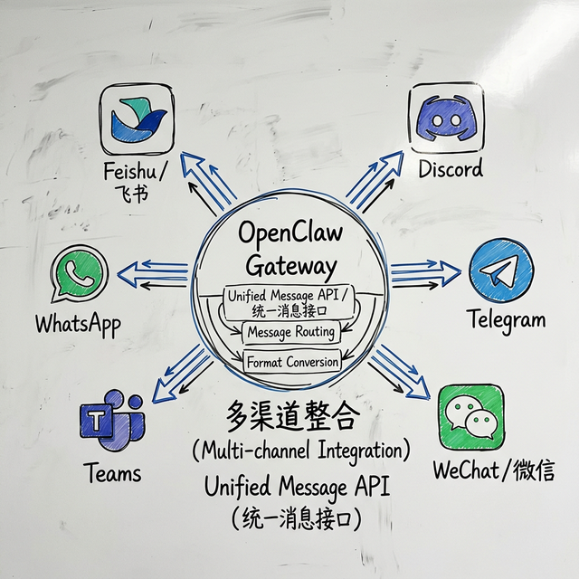

Feishu (飞书) · Discord · Telegram · Slack · WhatsApp · WeChat (微信) · Teams · WebChat

---

## 🏛️ Multi-Agent：多智能体协作

> **底层技术：如何实现“龙虾军团”的精准调度？**

- **独立环境** — 每个 Agent 拥有独立的 Auth、Session 与工作目录，严格隔离
- **独立职责** — 每个 Agent 拥有独立的职责，配置不同的模型，处理不同任务
- **互相协作** — Agent 之间可以互相协作，共同完成复杂任务

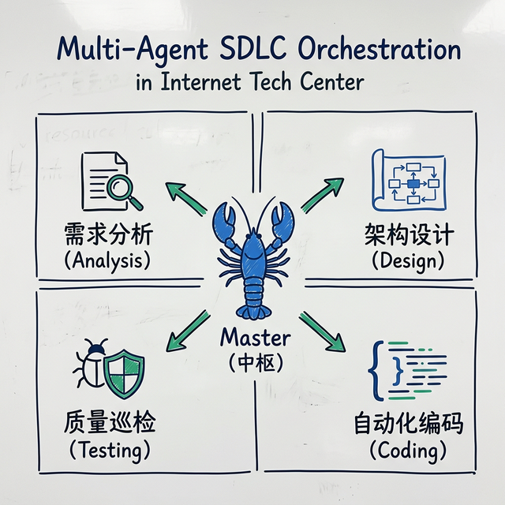

---

## 使用场景：打造你的 7×24 数字员工

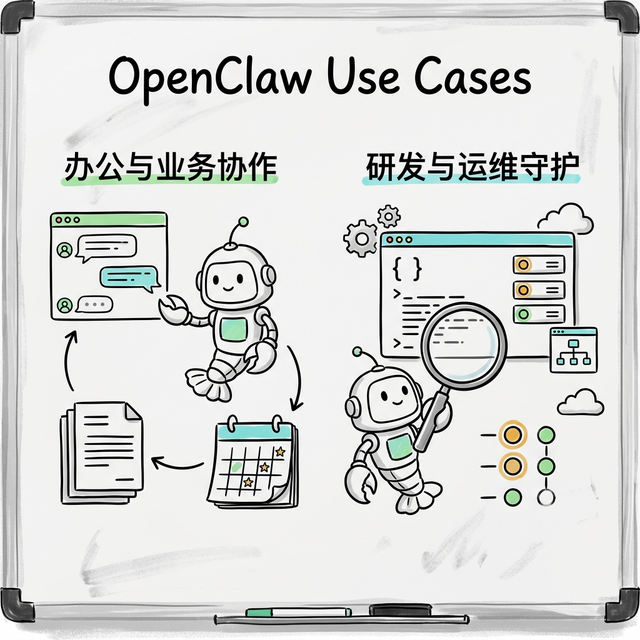

### 💼 智能协作与业务

- **飞书数字员工**：查阅文档、总结会议、管理团队日程
- **用户原声中心**：监控全渠道售后，自动聚类推送负责人
- **内部技能市场**：技术中心能力沉淀与复用

### 🛠️ 研发与运维守护

- **远程指挥编码**：IM 下达指令，自动化重构
- **质量与 Bug 巡查**：全天候巡检 Bug 与安全风险
- **运维线上巡检**：定时检查资源，提供诊断建议

---

## 快速上手

> **底层足够硬核，安装却异常简单**

```bash
# 安装
$ curl -fsSL https://openclaw.ai/install.sh | bash

# 配置
$ openclaw onboard --install-daemon

# 打开面板
$ openclaw dashboard
```

> 📖 文档：[docs.openclaw.ai](https://docs.openclaw.ai)
> 💻 源码：[github.com/openclaw/openclaw](https://github.com/openclaw/openclaw)

---

## Thank You 🦞

`github.com/openclaw` · `docs.openclaw.ai` · `discord.gg/clawd`
